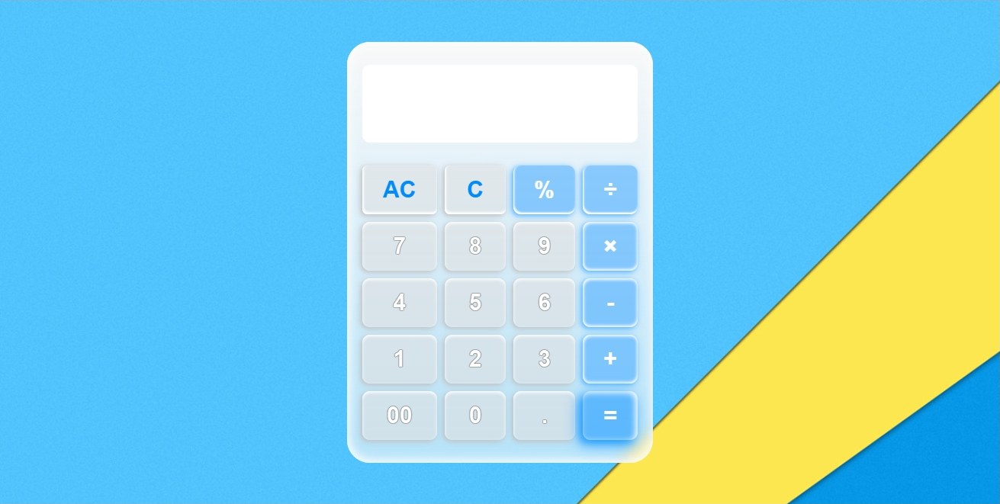
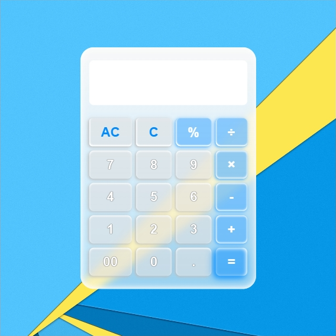
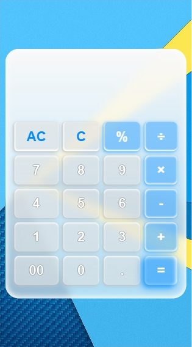

# Intermediate-Calculator
This was made with HTML, CSS and JavaScript. Got the chance to learn a lot in JavaScript with this project. I have to say, it was fun and brain-racking.

## Table of contents

- [Overview](#overview)
  - [Screenshot](#screenshot)
  - [Links](#links)
- [My process](#my-process)
  - [Built with](#built-with)
  - [Continued development](#continued-development)
- [Author](#author)

## Overview

### Screenshot

#### Desktop View

#### Tablet View

#### Mobile View

### Links

- Live Site URL: [Intermediate Calculator](https://harryjupiter148.github.io/Intermediate-Calculator/)

## My process

### Built with

- Semantic HTML5 markup
- CSS custom properties
- CSS Flexbox
- CSS Grid
- JavaScript

### Continued development

With this project being a success, I'll attempt the advanced version of the calculator. I hope to finish it as soon as possible.

## Author

- GitHub - [@harryjupiter148](https://github.com/harryjupiter148/Intermediate-Calculator)
- daily.dev - [@harry_jupiter148](https://app.daily.dev/harry_jupiter148)
